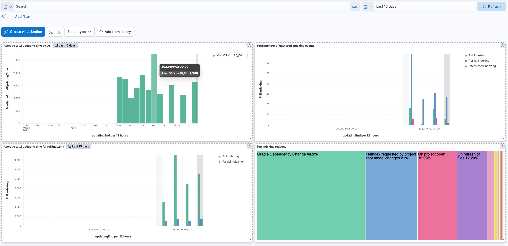

# indexing-metrics-collector

<!-- Plugin description -->
Allows gathering [IntelliJ IDEA](https://www.jetbrains.com/idea/) project scanning & indexing metrics for further analysis by ingesting them into an [elasticsearch](https://www.elastic.co/elasticsearch/elasticsearch) cluster.

* [Project Home](https://github.com/breskeby/indexing-metrics-collector)
* [Issue Tracker](https://github.com/breskeby/indexing-metrics-collector/issues)

<!-- Plugin description end -->

This [IntelliJ IDEA](https://www.jetbrains.com/idea/) plugin gives developer teams the chance to analyse how much time they spent on indexing their projects.
The plugin captures indexing events occurred in IDEA and pushes them into an [elasticsearch](https://www.elastic.co/elasticsearch/elasticsearch)  cluster for further analyzise. 

The captured data per indexing event includes

- project name
- total indexing time in ms
- indexing reason
- duration of file scanning in ms
- indexing duration in ms
- update start
- update end
- was full indexing (true / false)
- was indexing interrupted (true / false)
- environment
  - user name (can be optionally anonymized)
  - host name (can be optionally anonymized)
  - os name
  - os arch
  - os version

The [elasticsearch](https://www.elastic.co/elasticsearch/elasticsearch)  mapping template can be found here: [elasticsearch index mapping](https://github.com/breskeby/indexing-metrics-collector/blob/main/src/main/resources/idea-indexing-mapping.json)

The idea for this came up when I heard first time about [shared project index](https://www.jetbrains.com/help/idea/shared-indexes.html#project-shared-indexes) for IntelliJ IDEA.
If you want to know the impact of such a plugin you need to have hard numbers first. In a distributed team gathering these numbers are tricky so the idea
for this plugin was born.

## Installation

[//]: # (- Using IDE built-in plugin system:)

[//]: # (  )
[//]: # (  <kbd>Settings/Preferences</kbd> > <kbd>Plugins</kbd> > <kbd>Marketplace</kbd> > <kbd>Search for "idea-index-tracker"</kbd> >)

[//]: # (  <kbd>Install Plugin</kbd>)

- From plugin repository:

  - In <kbd>Settings/Preferences</kbd> > <kbd>Plugins</kbd> > <kbd>⚙️</kbd> > <kbd>Manage plugin repositories...</kbd> 
  add [https://raw.githubusercontent.com/breskeby/indexing-metrics-collector/main/updatePlugins-213.xml](https://raw.githubusercontent.com/breskeby/indexing-metrics-collector/main/updatePlugins-213.xml)
  - Install <b>indexing-metrics-collector</b> plugin

- Manually:

  Download the [latest release](https://github.com/breskeby/indexing-metrics-collector/releases/latest) and install it manually using
  <kbd>Settings/Preferences</kbd> > <kbd>Plugins</kbd> > <kbd>⚙️</kbd> > <kbd>Install plugin from disk...</kbd>

## Configuration

The plugin provides a preference page to configure elasticsearch connection data including
authentication options and index name to be used and the option (enabled by default) to anonymize user data like host name and user name

## Analyzing

The captured data allows gaining further insights why and how much time is spent on indexing in idea for your developers
This is an example [kibana](https://www.elastic.co/kibana/) dashboard used during development of this plugin

---
Plugin based on the [IntelliJ Platform Plugin Template][template].

[template]: https://github.com/JetBrains/intellij-platform-plugin-template
